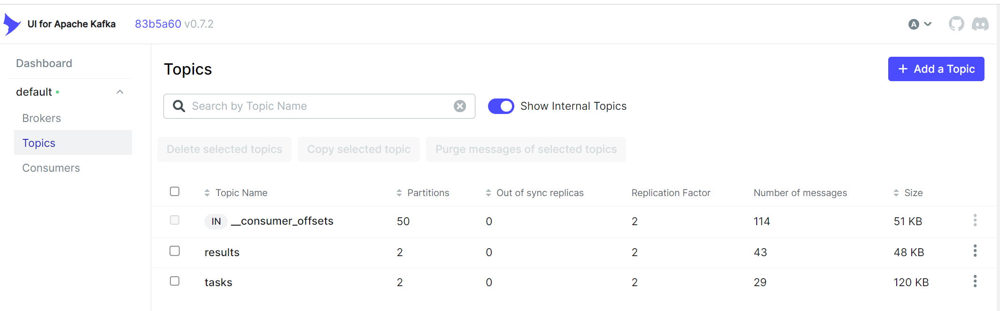

# Java Code Executor

## Описание

Java-приложение, которое вычитывает программный код из топика Apache Kafka, компилирует и выполняет его.
После выполнения отбрасывает в ответный топик результат выполнения.
Основное назначение — динамическое исполнение программного кода, поступающего по сообщениям Kafka.

## Особенности

- Подключение к Kafka для получения сообщений с кодом
- Компиляция и выполнение Java-кода на лету
- Обработка ошибок компиляции и выполнения

## Требования

- **Java 17+**
- **Gradle** для управления зависимостями
- **Docker и Docker Compose** для контейнеризации и управления сервисами

## Установка и запуск

### 1. Запуск `docker-compose`

1. Убедитесь, что порты `8079`, `8080`, `8090` свободны, если нет, то поменяйте конфигурацию


### 2. Локальный запуск приложения 

1. Укажите переменные окружения для версий java, например `JAVA_BIN_17=E:\project\jdks\jdk-17\bin`


### 3. Зайдите в kafka-ui, localhost:8090


### 4. Отправьте сообщения для запуска программного кода в топик `tasks`

Пример:
```json
{
  "taskId": "12345",
  "javaVersion": "17",
  "mainClass": "com.example.Main",
  "files": [
    {
      "name": "com/example/Main.java",
      "content": "package com.example;\n\npublic class Main {\n    public static void main(String[] args) {\n        System.out.println(\"Hello, world\");\n        Helper.sayHello();\n        PrimeSieve.run();\n    }\n}\n"
    },
    {
      "name": "com/example/Helper.java",
      "content": "package com.example;\n\npublic class Helper {\n    public static void sayHello() {\n        System.out.println(\"Hwllo, from helper class!\");\n    }\n}\n"
    },
    {
      "name": "com/example/PrimeSieve.java",
      "content": "package com.example;\n\n public class PrimeSieve {\n\n    /**\n     * Метод для вычисления всех простых чисел до заданного предела n\n     * с использованием решета Эратосфена.\n     *\n     * @param n верхний предел для поиска простых чисел\n     * @return массив простых чисел до n\n     */\n    public static int[] sieveOfEratosthenes(int n) {\n        boolean[] isPrime = new boolean[n + 1];\n        // Инициализируем массив, предполагая, что все числа простые\n        for (int i = 2; i <= n; i++) {\n            isPrime[i] = true;\n        }\n\n        // Применяем алгоритм решета Эратосфена\n        for (int p = 2; p * p <= n; p++) {\n            if (isPrime[p]) {\n                // Обозначаем кратные p числа как непростые\n                for (int i = p * p; i <= n; i += p) {\n                    isPrime[i] = false;\n                }\n            }\n        }\n\n        // Подсчитываем количество простых чисел\n        int count = 0;\n        for (int i = 2; i <= n; i++) {\n            if (isPrime[i]) {\n                count++;\n            }\n        }\n\n        // Заполняем массив простых чисел\n        int[] primes = new int[count];\n        int index = 0;\n        for (int i = 2; i <= n; i++) {\n            if (isPrime[i]) {\n                primes[index++] = i;\n            }\n        }\n\n        return primes;\n    }\n\n    public static void run() {\n        int limit = 100_000_000; // 100 миллионов\n        long startTime = System.currentTimeMillis();\n        \n        int[] primes = sieveOfEratosthenes(limit);\n        \n        long endTime = System.currentTimeMillis();\n        System.out.println(\"Find prime numbers: \" + primes.length);\n        System.out.println(\"Execution time: \" + (endTime - startTime) / 1000.0 + \" sec\");\n    }\n}"
    }
  ],
  "arguments": [],
  "stdin": "",
  "timeoutSeconds": "20"
}
```

### 5. Ожидайте ответа в топике `results`
```json
{
	"taskId": "12345",
	"status": "success",
	"output": "Hello, world\nHwllo, from helper class!\nFind prime numbers: 5761455\nExecution time: 0.652 sec\n",
	"error": "",
	"processExecutionStatistics": {
		"timeMs": 692,
		"processAvgMemoryUsageBytes": 138275297,
		"processMaxMemoryUsageBytes": 167546880,
		"exitCode": 0
	},
	"exitCode": 0
}
```